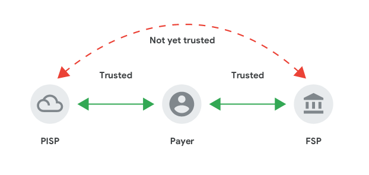

# 3PPI Account Linking Guide

<!-- TODO: explain difference between API reference and 'real'  -->
<!-- make this one more real with the demo -->
<!-- There's an API reference, you can play with this -->
<!-- when you're ready to make your own -->


> Reference: [3PPI-2021-whitepaper](https://static.googleusercontent.com/media/nextbillionusers.google/en//tools/3PPI-2021-whitepaper.pdf)

Learn how to use the [Synchronous 3PPI API](/apis/sync-3ppi.html) to establish an account link between a User, a DFSP and a 3rd Party Payment Initiator (3PPI).

> **Note - Base URLs for this guide:**
>
> For this guide, we will use the Base URL `http://sandbox.mojaloop.io/switch-ttk-backend`
> which returns simulated data.
>
> You may want to use the baseUrl of a live 3PPI, such as 
> `http://pispa-thirdparty-scheme-adapter-outbound.sandbox.mojaloop.io` or even run your own instance of the 3PPI and connect it to the Mojaloop Sandbox.

## 1. List Available DFSPs

```
GET /linking/providers
```

Before linking accounts, you need to look up the list of the DFSPs connected to the Mojaloop Hub that support account linking.

### Request:

Here's an example of using `/linking/providers` to list the DFSPs available for linkingusing the [Synchronous 3PPI API](/apis/sync-3ppi.html):

```bash
curl -X GET "http://sandbox.mojaloop.io/switch-ttk-backend/linking/providers" \
     -H  "accept: application/json"
```

### Response:

And we get the following response:

```bash
{
  "providers": [
    "dfspa",
    "dfspb"
  ],
  "currentState": "providersLookupSuccess"
}
```

Here you can see that there are 2 DFSPs available to link with, `dfspa` and `dfspb`. 

At this point, you can show this list to your user, and ask them _"Which provider do you hold an account with and want to establish an Account Link with?"_.

## 2. List the accounts for your user

Once your user has selected a DFSP that they want to link their account from, you can ask them for an identifier that the bank uses to log them in. This could be a Phone number, email address - anything as long as the DFSP can use it to identify their your mutual user.


```
GET /linking/accounts/{fspId}/{userId}
```
### Request:

You can then use this data to form the following request, where `fspId` is the DFSP your user selected from the list, and `userId` is the identifier your user entered.

```bash
curl -X GET "http://sandbox.mojaloop.io/switch-ttk-backend/linking/accounts/bankone/61414414414"\
     -H  "accept: application/json"
```

### Response:

And here's an example response from the server:

```json
[
  {
    "accountNickname": "dfspa.user.nickname1",
    "id": "dfspa.username.1234",
    "currency": "ZAR"
  },
  {
    "accountNickname": "dfspa.user.nickname2",
    "id": "dfspa.username.5678",
    "currency": "PHP"
  }
]
```

Here you can see 2 accounts found for the user's identifier at the DFSP, where:
- `accountNickname` is a user-readable nickname that the user can use to identify their account
- `id` is a linking-specific identifier for this combination of userId, 3PPI and dfsp. This can be a made up identifier by the DFSP, but it's important that (1): This id is not useful outside of the context of account liking, and (2): The DFSP is able to keep track of this identifier for subsequent requests.
- `currency` The currency of the funds that account holds

> **Note - Disclosing of user information**
>
> The DFSP may not wish to disclose the `accountNickname` field to their end user _before_ they have completed a login process.
> In this instance, the DFSP could choose to obfuscate parts of accountNickname field, such as sending `CheXXXXXXXX` instead of `Chequing Account`


At this point, you can display this list of accounts to your user, and ask them which they want to link with your 3PPI.

## 3. Request Consent

Once your user has selected one or more accounts for linking, you can issue a ConsentRequest to the DFSP:


```
POST /linking/request-consent
```

### Request:

```bash
curl -X POST "http://sandbox.mojaloop.io/switch-ttk-backend/linking/request-consent" \
      -H  "accept: application/json" \
      -H  "Content-Type: application/json" \
      -d '{
        "consentRequestId":"f6ab43b0-71cc-49f9-b763-2ac3f05ac8c1",
        "toParticipantId":"dfspa",
        "accounts":[{
          "accountNickname":"SpeXXXXXXXXnt",
          "id":"dfspa.username.5678",
          "currency":"PHP"
        }],
        "actions":["accounts.transfer"],
        "userId":"username1234",
        "callbackUri":"pisp-app://callback"
      }'
```

Let's break down the above request's data:

- `consentRequestId` - A uuid generated by you to identify the ConsentRequest
- `toParticipantId` - The DFSP selected by your user in previous steps
- `accounts` - The list of accounts your user selected
- `actions` - A list of account actions you are asking for consent to do. In this instance, it will just be a list containing the string `"accounts.transfer"`.
- `userId` - The userId used in previous requests
- `callbackUri` - The DFSP may wish to use a web-based login flow to authenticate your mutual user. In this instance, they need to be able redirect to your web app or mobile app at the end of the process. For this guide, the DFSP will use OTP login, so you can just leave this `callbackUri` for now.


### Response:

And the response back from the DFSP:

```json
{
  "channelResponse": {
    "consentRequestId": "f6ab43b0-71cc-49f9-b763-2ac3f05ac8c1",
    "scopes": [
      {
        "accountId": "dfspa.username.5678",
        "actions": [
          "accounts.transfer"
        ]
      }
    ],
    "authChannels": [
      "OTP"
    ],
    "callbackUri": "pisp-app://callback..."
  },
  "currentState": "OTPAuthenticationChannelResponseReceived"
}
```


The important field to note here is the item in the `authChannels` array. 

The DFSP chooses which auth flow to use to log in their user, either `OTP` or `WEB`. The response from the DFSP will always contain only 1 element.

If the `authChannels` array contains `WEB`, you will also receive a redirect url that you must redirect your user to in order to complete the login. After your user completes the login with their DFSP, the DFSP's webpage or application will redirect to yours using the `callbackUri`, and will contain an `authToken` in the request query parameters.

If the `authChannels` array contains `OTP`, your user will receive an OTP, and you must ask them to "enter the OTP you received from your DFSP to complete the authorization process".


## 4. Complete Authentication

At this point, you will have an `authToken`, either entered by your user, or passed in the redirect URI back from the DFSP's website or application.


```
PATCH /linking/request-consent/{ID}/authenticate
```


### Request:

```bash
curl -X PATCH "http://sandbox.mojaloop.io/switch-ttk-backend/linking/request-consent/b51ec534-ee48-4575-b6a9-ead2955b8069/authenticate" \
     -H  "accept: application/json" \
     -H  "Content-Type: application/json" \
     -d '{"authToken":"123456"}'
```


### Response:

Should the authToken be correct, the response you receive back from the DFSP will contain the Consent object, along with a `challenge`:

```json
{
  "consent": {
    "consentId": "76059a0a-684f-4002-a880-b01159afe119",
    "consentRequestId": "f6ab43b0-71cc-49f9-b763-2ac3f05ac8c1",
    "scopes": [
      {
        "accountId": "dfspa.username.5678",
        "actions": [
          "accounts.transfer"
        ]
      }
    ]
  },
  "challenge": "c4adabb33e9306b038088132affcde556c50d82f603f47711a9510bf3beef6d6",
  "currentState": "consentReceivedAwaitingCredential"
}
```

Note that for a `WEB` login flow, the DFSP may display some options to their user asking them to confirm the accounts to link, so the actual accounts linked may be have changed.

At this point, you can ask your user to create a Credential on their device, and use that credential to sign the `challenge`:

## 5. Register Credential

```
/linking/request-consent/{ID}/pass-credential
```

The API currently supports 2 credential types:
- `FIDO` - A public/private keypair generated by the webauthn FIDO2 specifiction. The private key lives somewhere in secure storage, such as 
- `GENERIC` - a generic public/private keypair credential where the private key can be stored by the 3PPI

</br>

This guide doesn't go into the details of registering the credential on the user's device, but we are working on another guide for you! In the meantime:
- [Read our demo front-end code](https://github.com/mojaloop/contrib-pisp-demo-ui) for registering a credential on Web and Android with Flutter
- [WebAuthN Guide](https://webauthn.guide/)


### Request:

```bash
curl -X POST "http://sandbox.mojaloop.io/switch-ttk-backend/linking/request-consent/b51ec534-ee48-4575-b6a9-ead2955b8069/pass-credential" \
     -H  "accept: application/json" \
     -H  "Content-Type: application/json" \
     -d '{
        "credential":{
          "credentialType":"FIDO",
          "status":"PENDING",
          "payload":{
            "id":"HskU2gw4np09IUtYNHnxMM696jJHqvccUdBmd0xP6XEWwH0xLei1PUzDJCM19SZ3A2Ex0fNLw0nc2hrIlFnAtw",
            "rawId":"HskU2gw4np09IUtYNHnxMM696jJHqvccUdBmd0xP6XEWwH0xLei1PUzDJCM19SZ3A2Ex0fNLw0nc2hrIlFnAtw==",
            "response":{
              "clientDataJSON":"eyJ0eXBlIjoid2ViYXV0aG4uY3JlYXRlIiwiY2hhbGxlbmdlIjoiWXpSaFpHRmlZak16WlRrek1EWmlNRE00TURnNE1UTXlZV1ptWTJSbE5UVTJZelV3WkRneVpqWXdNMlkwTnpjeE1XRTVOVEV3WW1ZelltVmxaalprTmciLCJvcmlnaW4iOiJodHRwOi8vbG9jYWxob3N0OjQyMTgxIiwiY3Jvc3NPcmlnaW4iOmZhbHNlfQ==",
              "attestationObject":"o2NmbXRmcGFja2VkZ2F0dFN0bXSjY2FsZyZjc2lnWEcwRQIhAN2JDPPTse/45EHSqSpEJiiok5sns+HqdJch3+gsL09VAiAh7W7ZhQC8gMIkgwcA+S4rQkaHoHnP9AkkohaKCuuA62N4NWOBWQLBMIICvTCCAaWgAwIBAgIECwXNUzANBgkqhkiG9w0BAQsFADAuMSwwKgYDVQQDEyNZdWJpY28gVTJGIFJvb3QgQ0EgU2VyaWFsIDQ1NzIwMDYzMTAgFw0xNDA4MDEwMDAwMDBaGA8yMDUwMDkwNDAwMDAwMFowbjELMAkGA1UEBhMCU0UxEjAQBgNVBAoMCVl1YmljbyBBQjEiMCAGA1UECwwZQXV0aGVudGljYXRvciBBdHRlc3RhdGlvbjEnMCUGA1UEAwweWXViaWNvIFUyRiBFRSBTZXJpYWwgMTg0OTI5NjE5MFkwEwYHKoZIzj0CAQYIKoZIzj0DAQcDQgAEIRpvsbWJJcsKwRhffCrjqLSIEBR5sR7/9VXgfZdRvSsXaiUt7lns44WZIFuz6ii/j9f8fadcBUJyrkhY5ZH8WqNsMGowIgYJKwYBBAGCxAoCBBUxLjMuNi4xLjQuMS40MTQ4Mi4xLjEwEwYLKwYBBAGC5RwCAQEEBAMCBDAwIQYLKwYBBAGC5RwBAQQEEgQQFJogIY72QTOWuIH41bfx9TAMBgNVHRMBAf8EAjAAMA0GCSqGSIb3DQEBCwUAA4IBAQA+/qPfPSrgclePfgTQ3VpLaNsBr+hjLhi04LhzQxiRGWwYS+vB1TOiPXeLsQQIwbmqQU51doVbCTaXGLNIr1zvbLAwhnLWH7i9m4ahCqaCzowtTvCQ7VBUGP5T1M4eYnoo83IDCVjQj/pZG8QYgOGOigztGoWAf5CWcUF6C0UyFbONwUcqJEl2QLToa/7E8VRjm4W46IAUljYkODVZASv8h3wLROx9p5TSBlSymtwdulxQe/DKbfNSvM3edA0up+EIJKLOOU+QTR2ZQV46fEW1/ih6m8vcaY6L3NW0eYpc7TXeijUJAgoUtya/vzmnRAecuY9bncoJt8PrvL2ir2kDaGF1dGhEYXRhWMRJlg3liA6MaHQ0Fw9kdmBbj+SuuaKGMseZXPO6gx2XY0EAAAAEFJogIY72QTOWuIH41bfx9QBAHskU2gw4np09IUtYNHnxMM696jJHqvccUdBmd0xP6XEWwH0xLei1PUzDJCM19SZ3A2Ex0fNLw0nc2hrIlFnAt6UBAgMmIAEhWCBYz+SV6fSy7ZjFzdj+SWxaMbfaw4ZT+wYgClN3v93kVSJYIGSzY41DNLrh1jXp4J53qCnq4+b9HYXud/0UEsZquDeV"
            },
          "type":"public-key"
        }
      }
    }' 
```

Here we have the credential object, which contains a publicKey and attestation certificate among other things.

The DFSP can use this to prove that this public/private keypair was created by a real human being, lives on a real device in secure storage, and that the 3PPI doesn't have access to the private key (and therefore can't initiate payments without their end user completing some authentication action).

### Response:

```json
{
  "credential": {
    "status": "VERIFIED"
  },
  "currentState": "accountsLinked"
}
```

Given this response from the DFSP, you can inform your user that the accounts have been linked successfully!