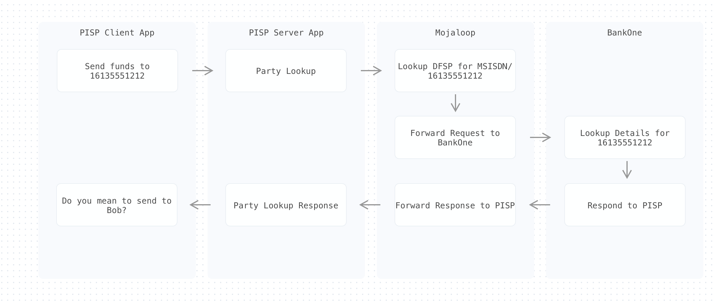
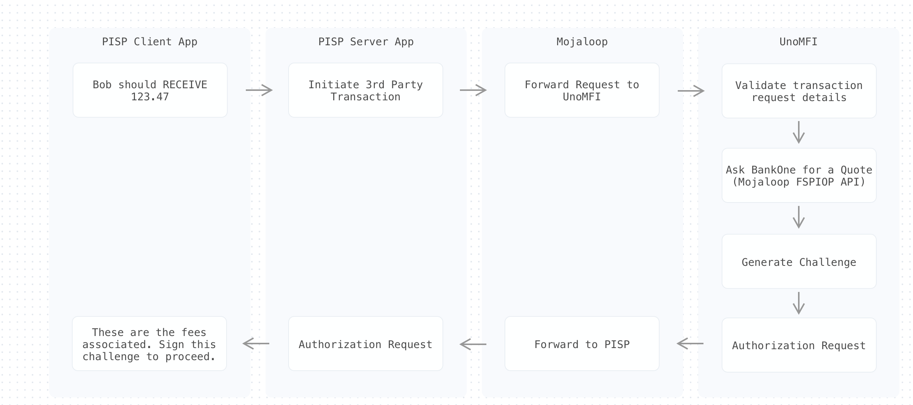
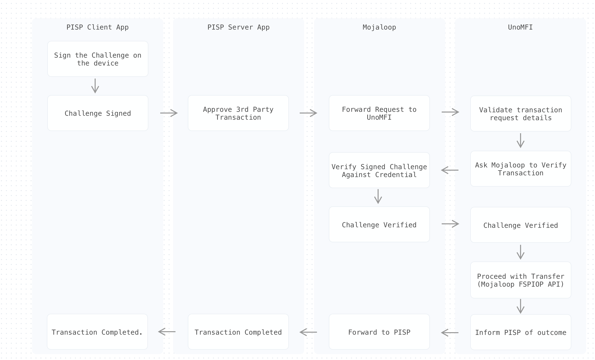

# 3PPI Payments


> Reference: [3PPI-2021-whitepaper](https://static.googleusercontent.com/media/nextbillionusers.google/en//tools/3PPI-2021-whitepaper.pdf)


Learn how to use the [Synchronous 3PPI API](/apis/sync-3ppi.html) to initiate a Peer to Peer (P2P) transaction from a 3rd Party Payment Initiator.

## Background

This guide assumes you are already familiar with 3PPI Payments, and have read the [3PPI Transfer Use Case Document](/usecases/3ppi-transfer.html)


In this guide we make the following assumptions:
- You are a PISP and have connected to a Mojaloop Hub.
- Ayeesha is your user and she has linked the account she holds with dfspa in your application.
- Ayeesha has registered a FIDO credential on her device, which you have an identifier for, and can ask her to 'sign' transactions using the FIDO credential
- Ayeesha wants to use your application to send funds from her account with dfspa to Bob Bobbington

<!-- TODO: left to right sequence overview -->

## 1. Party Lookup



```
POST /thirdpartyTransaction/partyLookup
```

The Party Lookup phase is where Ayeesha enters in the details of the person 
she wishes to send funds to from her PISP application.
1. In this instance, she wants to send to the phone number `16135551212`.    
2. Your application must generate a unique `transactionRequestId`, which takes 
the form of a UUID v4 string.
3. Then, using the Sync 3PPI, your app can perform the party lookup.

### Request:

Here's an example of the HTTP Request for a Party Lookup when using the [Synchronous 3PPI API](/apis/sync-3ppi.html)

```bash
curl -X POST "http://sandbox.mojaloop.io/switch-ttk-backend/thirdpartyTransaction/partyLookup" \
  -H  "accept: application/json" \
  -H  "Content-Type: application/json" \
  -d '{ 
    "transactionRequestId": "b51ec534-ee48-4575-b6a9-ead2955b8069",
    "payee": {
      "partyIdType": "MSISDN",
      "partyIdentifier":"16135551212"
    }
  }'
```

### Response:

And we get the following response:

```bash
{
  "currentState": "partyLookupSuccess",
  "party": {
    "partyIdInfo": {
      "partyIdType": "MSISDN",
      "partyIdentifier": "16135551212",
      "fspId": "dfspb"
    },
    "name": "Bob bobbington"
  }
}
```

The `party` object describes the information of the person receiving the funds.

In your application, you can show Ayeesha Bob's details, and ask her to confirm
that this is the intended recipient.

<!-- TODO: ui snippet showing what an app might show it's user -->


## 2. Initiate 




Once Ayeesha confirms that this is the intended receipient of the funds, 
you can ask her how much she wants to send, and whether she wants Bob to
receive that amount, or she wants to send that amount (this affects the
fee calculations).


### Request:

You can then use this data to form the following request:

```bash
curl -X POST "http://sandbox.mojaloop.io/switch-ttk-backend/thirdpartyTransaction/b51ec534-ee48-4575-b6a9-ead2955b8069/initiate" -H  "accept: application/json"\
  -H  "Content-Type: application/json" \
  -d '{
    "payee":{
      "name":"Bob bobbington",
      "partyIdInfo":{
        "fspId":"dfspb",
        "partyIdType":"MSISDN",
        "partyIdentifier":"16135551212"
      }
    },
    "payer":{
      "partyIdType":"THIRD_PARTY_LINK",
      "partyIdentifier":"16135551212",
      "fspId":"dfspa"
    },
    "amountType":"RECEIVE",
    "amount":{
      "currency":"USD",
      "amount":"123.47"
    },
    "transactionType":{
      "scenario":"TRANSFER",
      "initiator":"PAYER",
      "initiatorType":"CONSUMER"
    },
    "expiration":"2021-05-24T08:38:08.699-04:00"
  }'
```


Let's examine each of these fields so we can understand what's going on:

- `payee` - The intended recipient of the transfer. This section can be copied from the `partyLookup` response
- `payer` - The details of the `THIRD_PARTY_LINK` that were established between your app and Ayeesha's DFSP when performing the account link. [Read more about the linking process.](https://github.com/mojaloop/pisp-project/tree/master/docs/linking#16-credential-registration)
- `amountType` - `RECIEVE` if Ayeesha intended Bob to receive `$123.47` exactly, and pay any fees in addition to that amount, or `SEND` if Ayeesha wanted Bob to recieve `$123.47` minus any fees.
- `amount` - The amount of funds to be sent, and their currency
- `transactionType` - A series of fields that describe the characteristics of the transaction. [Read more here](https://docs.mojaloop.io/mojaloop-specification/documents/API%20Definition%20v1.0.html#531-p2p-transfer)
- `expiration` - How long the Transaction Request is valid for. Requests after this time period should be rejected by the DFSP.


### Response:

And this is the response we recieve back from the above request:

```json
{
  "currentState": "authorizationReceived",
  "authorization": {
    "authorizationRequestId": "7bf48d21-03fa-439f-953e-1ced5ed7b3d2",
    "transactionRequestId": "b51ec534-ee48-4575-b6a9-ead2955b8069",
    "challenge": "f92ksdh3FYFDKaskdf08dnofuPPHfr",
    "quote": {
      "transferAmount": {
        "amount": "124.47",
        "currency": "USD"
      },
      "payeeReceiveAmount": {
        "amount": "123.47",
        "currency": "USD"
      },
      "payeeFspFee": {
        "amount": "1.00",
        "currency": "USD"
      },
      "expiration": "2022-01-01T08:38:08.699-04:00",
      "ilpPacket": "AYIBgQAAAAAAAASwNGxldmVsb25lLmRmc3AxLm1lci45T2RTOF81MDdqUUZERmZlakgyOVc4bXFmNEpLMHlGTFGCAUBQU0svMS4wCk5vbmNlOiB1SXlweUYzY3pYSXBFdzVVc05TYWh3CkVuY3J5cHRpb246IG5vbmUKUGF5bWVudC1JZDogMTMyMzZhM2ItOGZhOC00MTYzLTg0NDctNGMzZWQzZGE5OGE3CgpDb250ZW50LUxlbmd0aDogMTM1CkNvbnRlbnQtVHlwZTogYXBwbGljYXRpb24vanNvbgpTZW5kZXItSWRlbnRpZmllcjogOTI4MDYzOTEKCiJ7XCJmZWVcIjowLFwidHJhbnNmZXJDb2RlXCI6XCJpbnZvaWNlXCIsXCJkZWJpdE5hbWVcIjpcImFsaWNlIGNvb3BlclwiLFwiY3JlZGl0TmFtZVwiOlwibWVyIGNoYW50XCIsXCJkZWJpdElkZW50aWZpZXJcIjpcIjkyODA2MzkxXCJ9IgA",
      "condition": "f5sqb7tBTWPd5Y8BDFdMm9BJR_MNI4isf8p8n4D5pH"
    },
    "transactionType":{
      "scenario":"TRANSFER",
      "initiator":"PAYER",
      "initiatorType":"CONSUMER"
    }
  }
}
```


Let's break down some of the important fields in the `authorization` object:

- `challenge` -  The challenge information to be signed by Ayeesha's FIDO credential if she proceeds with the transaction. The challenge is generated by the DFSP and cannot be guessed ahead of time by the PISP.
- `quote` - The internal quotation object that contains information about which parties will recieve what funds
  - `quote.transferAmount` - The total amount that Ayeesha will be sending
  - `quote.payeeReceiveAmount` - The total amount that will be received by Bob
  - `quote.payeeFspFee` - A fee charged by the Payee DFSP.


From this response, your app should show Ayeesha any fees associated with her transfer and
ask if she wants to proceed.

## 3. Approve




If she consents to the transfer, you can then ask Ayeesha to digitally sign the challenge using
the credential she registered earlier.

For more information on this step, refer to [signing the transfer challenge](https://github.com/mojaloop/pisp-project/tree/master/docs/transfer#123-signed-authorization).

A full implementation of this step requires a real credential to be registered on your user's device, and access to the WebAuthN APIs.

For the purposes of this demo, we've provided a pre-signed payload that you can copy 
and paste into the API requests.


### Request

```bash
curl -X POST "http://sandbox.mojaloop.io/switch-ttk-backend/thirdpartyTransaction/b51ec534-ee48-4575-b6a9-ead2955b8069/approve" 
  -H  "accept: application/json" \
  -H  "Content-Type: application/json" \
  -d '{
    "authorizationResponse": {
      "authenticationInfo": {
        "authentication":"U2F",
        "authenticationValue": {
          "pinValue":"xxxxxxxxxxx",
          "counter":"1"
        }
      },
    "responseType":"ENTERED"
    }
  }'
```


After issung the signed challenge, the DFSP will lookup the previously regsistered credential, and confirm that
the challenge was indeed signed by the private key that Ayeesha registered. If this checks out, the DFSP now has
a strong guarantee that Ayeesha did indeed consent to this transaction, and can proceed.

After the transaction is issued between the 2 DFSPs, Ayeesha's DFSP will send a confirmation back to your PISP,
and you will recieve the following response:
### Response 

```json
{
  "transactionStatus": {
    "transactionId": "8f6b2a9c-df32-4248-b115-799beada85ec",
    "transactionRequestState": "ACCEPTED"
  },
  "currentState": "transactionStatusReceived"
}
```

At this point, you can inform Ayeesha the funds have been transferred!