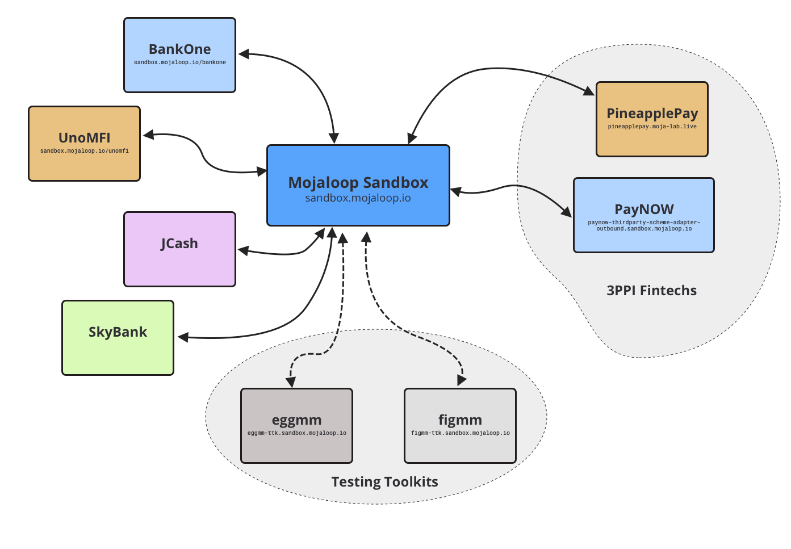

# Sandbox Overview

## Key Terms
> The following are terms and Acronyms you will see often - come back to this list if you get lost!

| Term |  Meaning | More Information |
|---|---|---|
| `DFSP` | Digital Financial Service Provider | A generic term for a financial intitution. E.g.  banks, credit unions, mobile money operators, microfinance organizations |
| `FSP`  | Used interchangably with `DFSP` | |
| `3PPI` | 3rd Party Payment Initiator | A type of Mojaloop Participant who doesn't hold any funds on behalf of users, but uses the 3PPI API to link accounts and make transfers. Most likely this is going to be a Fintech offering modern open banking services.    |
| `Participant` | An institution who interacts with Mojaloop | |
| `Party`| An end user, who interacts with a `DFSP` | A DFSP's customer. Usually a person, but it could be a Business or Merchant |
| `Hub Operator` | The organization that runs the Mojaloop Hub | |

## The Model Village

The Mojaloop Sandbox is modelled around a fictional village, somewhere deep in the jungles of the Philippines.   

 
The model village is full of different Users, Merchants, Banks, Microfinance Institutes and Fintechs.

### Key Details:

- **Currency**: `PHP`
- **BaseUrl**: `http://sandbox.mojaloop.io`
- **Supported PartyIdTypes**: `MSISDN`, `ALIAS`, `BUSINESS`

Out of the box, this environment includes the following simulated DFSPs.

These simulated DFSPs are able to send and recieve funds, and the Testing Toolkits are able to initiate transactions and monitor callbacks.
### DFSPs

The Sandbox has a variety of DFSP simulators, which support different use cases from P2P transfers, 3PPI Account Linking and 3PPI Transfers

| Name | participantId | Description | URL (if applicable) |
| --- | --- | --- | --- |
| BankOne | `bankone`  | A DFSP who also supports 3PPI account linking + payment functions. | [http://sandbox.mojaloop.io/bankone](http://sandbox.mojaloop.io/bankone) |
| UnoMFI  | `unomfi`   | A DFSP who also supports 3PPI account linking + payment functions. | [http://sandbox.mojaloop.io/unomfi](http://sandbox.mojaloop.io/unomfi) |
| JCash   | `jcash`    | A mobile money operator-based DFSP | |
| SkyBank | `skybank`  | A traditional bank-based DFSP | |
| eggmm   | `eggmm`    | A mobile money company - testing toolkit only (cannot receive payments) | [eggmm](http://eggmm-ttk.beta.moja-lab.live/admin/monitoring)
| figgmm   | `eggmm`    | A mobile money company - testing toolkit only (cannot receive payments) | [figmm](http://figmm-ttk.beta.moja-lab.live/admin/monitoring)

> **💡 Tip!**:
>  
> You can browse the list available DFSPs with this api call:
> [`http://sandbox.mojaloop.io/api/admin/central-ledger/participants`](http://sandbox.mojaloop.io/api/admin/central-ledger/participants)

### 3PPI Fintechs
| Name | participantId | Description | URL |
| --- | --- | --- | --- |
| PineapplePay | `pineapplepay`  | A 3PPI App which lets you link accounts and make payments | [https://pineapplepay.moja-lab.live/](https://pineapplepay.moja-lab.live/) |
| PayNOW  | `paynow`   | An example 3PPI which exposes the sync 3PPI API for you to build with! | [http://paynow-thirdparty-scheme-adapter-outbound.sandbox.mojaloop.io](http://paynow-thirdparty-scheme-adapter-outbound.sandbox.mojaloop.io/health) |

### Parties

While the Mojaloop API allows for a large number of PartyId Types, this Mojaloop Sandbox supports Parties of 3 types:
- `MSISDN` - ie. Phone Number
- `ALIAS` - a generic Alias that can be determined by a Scheme
- `BUSINESS` - a business identifier

These parties are registered and available for lookup in the Account Lookup Service for this Sandbox.

#### `MSISDN`
| Id Type | Id Value | participantId |Display Name |
| --- | --- | --- | --- |
| `MSISDN` | `589408120`  | `jcash`   | Paolo Fernandez |
| `MSISDN` | `949309489`  | `jcash`   | Rnell Durano |
| `MSISDN` | `218449123`  | `jcash`   | Mia Ruiz |
| `MSISDN` | `292455793`  | `jcash`   | Brownie Vilar |
| `MSISDN` | `329294234`  | `skybank` | Daniel Rizal |
| `MSISDN` | `32929124`   | `skybank` | Alejandro Leon |
| `MSISDN` | `910498498`  | `skybank` | Dobby Labella    |
| `MSISDN` | `4448483173` | `skybank` | Marvin Garcia |

#### `ALIAS`

| Id Type | Id Value | participantId |Display Name |
| --- | --- | --- | --- |
| `ALIAS` | `000394`       | `jcash`   | Datu Puti |
| `ALIAS` | `rnell@me.com` | `jcash`   | Rnell Durano |
| `ALIAS` | `dr@skybank`   | `skybank` | Daniel Rizal |
| `ALIAS` | `1123989`      | `skybank` | Mga Amiga |

#### `BUSINESS`

| Id Type | Id Value | participantId |Display Name |
| --- | --- | --- | --- |
| `BUSINESS` | `001239`  | `jcash`   | Mr. Pandesal |
| `BUSINESS` | `023923`  | `jcash`   | Baboy King Pty. Ltd. |
| `BUSINESS` | `499488`  | `skybank` | Outstanding Butanding |
| `BUSINESS` | `049049`  | `skybank` | Voyage PH |

<!-- ## APIs

Mojaloop has a variety of APIs you can interact with:

| Name | Version | Who | Base URL |
| --- | --- | --- | --- |
| [FSPIOP (Mojaloop API)](/2-apis/fspiop)     | `v1.1` | DFSPs             | `beta.moja-lab.live/api/fspiop` |
| [Admin](2-apis/admin)                       | `v1`   | Hub Admins, DFSPs | `beta.moja-lab.live/api/admin/central-ledger` |
| [Settlement](2-apis/settlement.html)        | `v1`   | DFSPs             | (not currently available with this lab) |
| [Thirdparty-DFSP](/2-apis/thirdparty-dfsp)  | `v0.1` | DFSPs             | (Coming Soon) |
| [Thirdparty-PISP](/2-apis/thirdparty-pisp)  | `v0.1` | PISPs             | (Coming Soon) |  -->

<!-- ## Use Cases  -->

<!-- 

The following Use Cases are supported in this lab:

|    | Name | Description | Status | Links |
|--- | ---- | ---- | ---- | ---- |
| 🟢 | P2P  | Peer To Peer transaction, from one party to another | Available | [P2P Transfer (Easy)](/guides/5_ttk_p2p.html) |
| 🟡 | PISP P2P | Peer To Peer transaction, initiated from 3rd party | Available (Locally) | [Thirdparty PISP API Local](/guides/6_pisp_local.html) |
| 🔴 | SEPA  | Cross Network, Outside Mojaloop into Mojaloop - Will be added with MIFOS Payment Hub | Coming Soon | _link coming soon!_|
| 🔴 | OTT Thirdparty (UK Open Banking Model) | P2P, PISP PSD2 approach - will be added with MIFOS Payment Hub | Coming Soon | _link coming soon!_|
| 🔴 | Refund | DFSP Initiated Refund Scenario - included with MIFOS Payment Hub | Coming Soon | _link coming soon!_| -->

<!-- ### Roadmap

_The following is our roadmap for adding more use cases to the Mojaloop OSS Lab:_

- Request to Pay 
- Merchant Payment Scenarios
  - dynamic QR codes
  - static QR codes
- Bulk Transfers (G2P)
- Cross Currency
- Cross Network
- AISP OTT 
- Bill Payments
- GSMA MM API
- ATM
- Reconciliation - failed transactions
- Fraud Monitoring + Detection
- Settlement (Hub Operator)
- Liquidity management (Hub Operator)

## Tools

This sandbox includes the following tools:

- [Sandbox Dev Hub](http://beta.moja-lab.live/home/0-getting-started)
- [Mojaloop Testing Toolkits](#testing-toolkit)
- [Simulator UI](http://simulator-ui.beta.moja-lab.live) - for more information on using the simulator-ui, refer to [todo this external guide]() -->

### Testing Toolkits

The [Mojaloop Testing Toolkit](https://github.com/mojaloop/ml-testing-toolkit) is a tool for testing your DFSP's implementation. It also helps you get up and running and 

We currently have 2 DFSPs hooked up to the testing toolkit: `figmm` and `eggmm`

See:
- [figmm - monitoring](http://figmm-ttk.beta.moja-lab.live/admin/monitoring) to monitor live requests and callbacks
- [figmm - send requests](http://figmm-ttk.beta.moja-lab.live/admin/outbound_request) to make live requests _from_ `figmm` to other DFSPs on the network
- [eggmm - monitoring](http://eggmm-ttk.beta.moja-lab.live/admin/monitoring) to monitor live requests and callbacks
- [eggmm - send requests](http://eggmm-ttk.beta.moja-lab.live/admin/outbound_request) to make live requests _from_ `eggmm` to other DFSPs on the network
  > Hint: Click "Load Sample" to look through the sample test cases available and load one

Check out the [Testing Toolkit P2P Guide](/guides/5_ttk_p2p/) to use the testing to send a peer to peer transfer.

<!-- ### MIFOS Payment Hub

This lab is soon to be connected with the MIFOS Payment Hub, which will demonstrate the MIFOS and Mojaloop ecosystems working together, and let you test out a whole bunch of DFSP-based features.

**Check back soon for more information about the Mojaloop OSS Lab + MIFOS Payment Hub** -->

<!-- I commented the below out, since the MB Lab was retired after the hackathon -->
<!-- we should be able to add these back once the IAC is working... -->
<!-- ### Payment Manager

> Note: Payment Manager support in the sandbox is still in _beta_, and the dfsps here are not yet connected to the other DFSPs in the sandbox. We're working on it!

- [Payment Manager- senderfsp](http://senderfsp-pm4ml.pm4ml.demo.modusbox.io/transfers) -->

<!-- ### Finance Portal

*Coming Soon!* -->

## Helpful Links

- [Mojaloop Documentation](https://docs.mojaloop.io/documentation/)
- [Mojaloop API Definition v1.0](https://docs.mojaloop.io/mojaloop-specification/documents/API%20Definition%20v1.0.html)
- [Mojaloop API OpenAPI (Swagger) Definitions](https://github.com/mojaloop/mojaloop-specification/blob/master/fspiop-api/documents/v1.1-document-set/)

