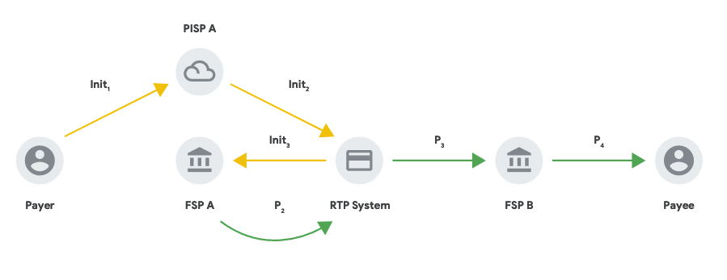

# 3PPI Transfer

> Reference: [3PPI-2021-whitepaper](https://static.googleusercontent.com/media/nextbillionusers.google/en//tools/3PPI-2021-whitepaper.pdf)

## Key Takeaways:
- Using the 3rd Party API, 3rd party apps and systems can directly initiate payments for account holders _without having to be a Financial Service Provider_
- New biometric authentication & device-level mechanisms mean networks can collaboratively start to move away from only PINs & OTPs as an authorisation mechanism.

## Actors
- **Ayeesha**: The end user of both the PISP and DFSP. Ayeesha initiates payments from the PISP's application, which has a _linked account_ with the DFSP.
- **PineapplePay**: PineapplePay is a PISP, connected to the Mojaloop Switch. Ayeesha has signed up for PineapplePay and linked her accounts from her DFSP, BankOne to her PineapplePay app on her device.
- **BankOne**: BankOne is a DFSP connected to a Mojaloop Hub. Ayeesha is a customer with BankOne, and holds an account with BankOne.
- **Alice**: Alice holds an account with a DFSP that is connected to a Mojaloop Hub. She has the identifier `25423839138`
## Scenario

- Ayeesha wants to send 18 USD to Alice using the PineapplePay App
- Ayeesha has already linked the account she holds with BankOne to her PineapplePay App. (See [3ppi Account Linking](./3ppi-account-linking))
- Alice has provided Ayeesha with an identifier she wants to recieve funds at: `25423839138`

<!-- TODO: linear sequence diagram here... -->
### 1. Discovery
 

1. Ayeesha enters the identifier she knows for Alice, `25423839138`
2. PineapplePay looks up this identifier with the Mojaloop Hub, and returns the response from Alice's DFSP, with some identifying information that allows Ayeesha to confirm that Alice will indeed be the receipient of the funds.

### 2. Agreement
 

1. Once Ayeesha confirms that it is indeed Alice she wishes to send funds to, PineapplePay asks Ayeesha how much she wishes to send. 
2. PineapplePay uses the ThirdParty API to ask BankOne to create a quotation request
3. Since Ayeesha's account is already linked with BankOne, BankOne knows about the account link and is happy to proceed.
4. BankOne requests a Quotation with Alice's DFSP, and returns a summary of that quotation to PineapplePay
5. PineapplePay displays the terms of the transfer to Ayeesha, and asks her if she is willing to proceed with the transfer to Alice.

### 3. Authorization
 

1. If Ayeesha agrees to the terms, PineapplePay asks her to perform an 'unlock action' on her device
2. This action signs some details about the transaction using a credential Ayeesha registered previously, giving it a "stamp of approval"
3. This stamp of approval is sent back to the BankOne to verify. Once verified, BankOne proceeds with the transfer.

### 4. Transfer
 

1. BankOne completes the transfer with Alice's DFSP, and then informs PineapplePay of the result
2. PineapplePay then informs Ayeesha that the transfer was completed.

## What's Next:
- [Implement this usecase yourself with our ThirdParty API Guide](/guides/payments/3ppi-p2p)
- [Learn More about the ThirdParty APIs](/apis/sync-thirdparty)